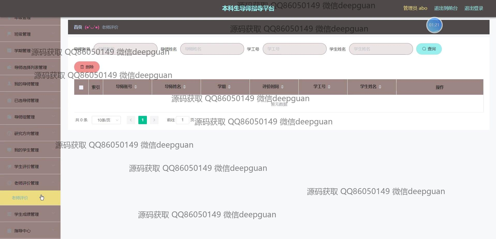
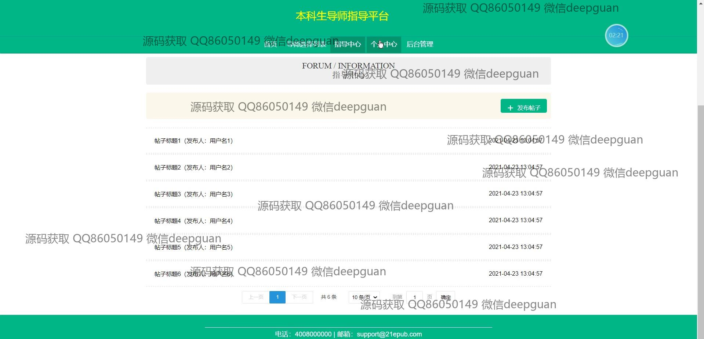
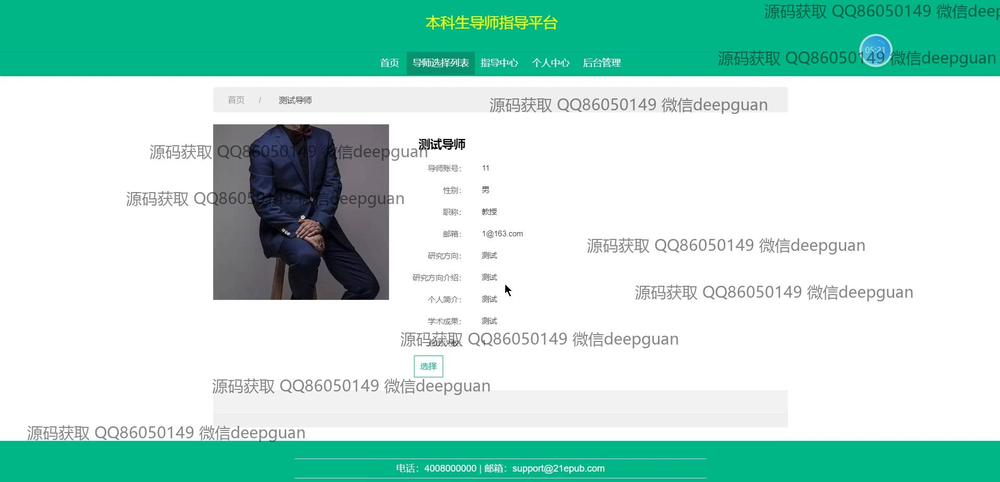
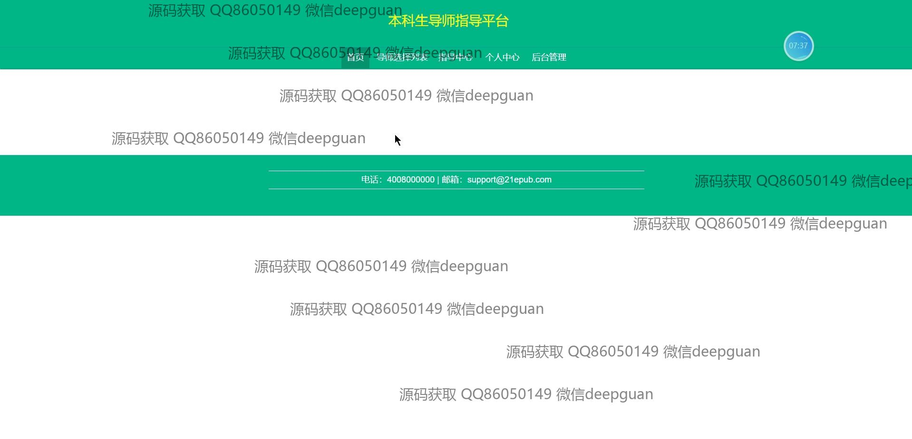

<h1 align="center">本科生导师指导平台+vue</h1>

## 简介
本科生导师指导平台：角色分为学生、导师和管理员；提供个人信息管理、导师选择、学生评价管理、学院和专业管理等功能，界面简洁，功能模块清晰，便于用户操作与导航。    --计算机毕业设计源码；毕设源码；java毕业设计源码

## 联系方式

<h3 align="center">获取完整代码与数据库文件 + 微信：deepguan QQ: 86050149 QQ群: 783742310</h3>

<h3 align="center">可帮忙远程部署 包运行成功！提供远程部署、修改代码、设计文档指导、代码讲解等服务！</h3>

## 功能介绍（完整见运行截图）
管理员：提供用户注册、登录及退出功能，支持学生和导师的注册管理。首页导航引导用户访问不同管理模块，涵盖学生管理、导师管理、学院管理、专业管理、年级管理和班级管理等。管理员可查看和编辑导师组信息，管理学期设置、学生评估及成绩，配置导师选择列表，进行系统时间管理，完善学生与导师信息录入及更新。同时负责审核和分配选择导师志愿顺序，确保系统运行顺畅。

导师：导师通过登录平台访问个人中心，进行信息编辑和查看，包括账号、姓名、性别、职称、联系方式等个人资料管理。导师可以管理自己的学生，查看已选和未选学生列表。同时，导师可在平台上提供研究方向、学术成果及个人简介信息，以增强学生选择意愿。平台允许导师参与到学生指导、评价管理中，进行学期计划和指导记录的输入与更新，确保学生获得个性化及有效的指导服务。

学生：学生在平台上注册并登录后，可访问个人中心查看和更新个人资料，包括学号、姓名、学院、专业、年级、班级等信息。可使用导师选择列表管理功能，查询和选择志愿导师，上传个人照片，填写研究方向、个人简介及学术成果等。学生可选择第一、第二及第三志愿导师，并参与导师评价，填写反馈意见，优化自身学习体验。学生也可以在平台上查看和管理成绩，以及评估信息，确保学习过程透明和高效。

访客：通过平台主页导航，访客可以了解系统功能及其用途，注册成为学生或导师用户。界面设计简洁，强调教育氛围，通过初次使用说明及详细指导帮助用户顺利完成注册过程，并提供清晰的时间显示，方便操作。访客可以通过查看注册表单、登录页面获得初步了解，并在需要时获取支持与帮助，不断优化潜在用户体验。

## 运行截图

本代码来源于网络,仅供学习参考使用!

